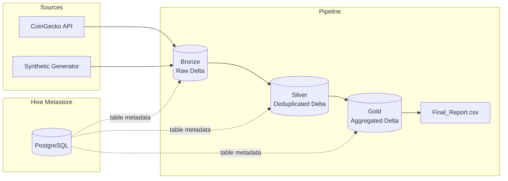

# High-Volume Market Data Pipeline

A robust, end-to-end data engineering pipeline designed to ingest, process, and analyze high-volume cryptocurrency market data. This project implements a **Medallion Architecture** (Bronze, Silver, Gold) using **Apache Spark**, **Delta Lake**, and an external **Hive Metastore** backed by **PostgreSQL**.

## Tech Stack

| Category | Technology | Description |
| :--- | :--- | :--- |
| **Processing Engine** | **Apache Spark 3.5.0** | Distributed data processing. |
| **Storage Format** | **Delta Lake 3.0.0** | ACID transactions and scalable metadata. |
| **Database/Metastore** | **PostgreSQL 16** | External Hive Metastore for table cataloging. |
| **Containerization** | **Docker & Compose** | Simplifies deployment of Spark clusters. |
| **Orchestration** | **PowerShell** | Automated pipeline execution script. |

## Architecture & Data Layers

The pipeline follows the Medallion design pattern to ensure data quality and reliability:

* **Bronze Layer (Raw):** Ingests raw data from the **CoinGecko API** (API mode) or from the **synthetic data generator** (stress-test mode). All layers are partitioned by **partition_date**, which is always derived from the data: `partition_date = to_date(last_updated)`. We never use the current run date for partitioning, so historical data is stored in the correct date folder in both modes.
* **Silver Layer (Cleaned):** Performs data type casting and deduplication on `(id, last_updated)` using **Spark Window Functions**. Reads the full Bronze table (all partition dates) and merges/overwrites by partition; no filter by "today."
* **Gold Layer (Aggregated):** Computes market stats **per partition_date** (top-10 by volume, total market cap, average price). The Gold table and `Final_Report.csv` have **one row per partition_date** present in the data—e.g. 7 days in Bronze yield 7 rows in the report, not just the latest date.

### Partitioning & Accumulation

* **Unified partitioning:** In both API and stress-test runs, `partition_date` is derived only from `last_updated` in the row. If the API omits `last_updated`, it is set from ingestion time so the partition is still data-driven.
* **Bronze accumulation (API mode):** Writes use **replaceWhere** for only the current run’s partition_date(s). Other partition dates in the Delta table are left unchanged, so the table grows over time and can retain multiple days (e.g. the last 7 days of API snapshots) without deleting previous days.
* **Silver/Gold:** Both stages read the full table and group or filter by the actual `partition_date` from the data, so the final report reflects all available days.

### Visual Architecture



The **Hive Metastore** (PostgreSQL) runs as a side-car and stores table metadata for all Delta layers; the pipeline registers the Gold table there after each run.

## Getting Started

### Prerequisites
* Docker and Docker Compose installed.
* PowerShell.

### Pipeline Modes

| Mode | How to run | Description |
| :--- | :--- | :--- |
| **Standard (API)** | `.\run_pipeline.ps1` | Fetches top N coins from CoinGecko. Bronze accumulates by partition_date (replaceWhere); Gold report shows one row per day present in Bronze. |
| **Stress Test** | `.\run_pipeline.ps1 -StressTest` | Uses the synthetic data generator (no API). Optional: `-Coins`, `-Days`, `-ExecMemory`, `-TotalCores`. |

Environment variables for API mode: `TOP_N_COINS` (default 50), `API_PAGES` (default 1). For stress test: `STRESS_TEST_COINS`, `STRESS_TEST_DAYS`.

### Setup and Execution (PowerShell)

1.  **Spin up infrastructure:**
    ```powershell
    docker-compose up -d
    ```

2.  **Option A: Run the full pipeline (Recommended)**
    ```powershell
    # Standard mode (CoinGecko API)
    powershell -ExecutionPolicy Bypass -File .\run_pipeline.ps1

    # Stress-test mode (synthetic data) — switch and optional flags
    powershell -ExecutionPolicy Bypass -File .\run_pipeline.ps1 -StressTest
    powershell -ExecutionPolicy Bypass -File .\run_pipeline.ps1 -StressTest -Coins 100 -Days 7
    powershell -ExecutionPolicy Bypass -File .\run_pipeline.ps1 -StressTest -Coins 200 -Days 30 -ExecMemory 4g -TotalCores 22
    ```
    | Flag | Description | Default |
    | :--- | :---------- | :------ |
    | `-StressTest` | Use synthetic generator instead of API | — |
    | `-Coins` | Number of synthetic coins | 200 |
    | `-Days` | Days of hourly history | 30 |
    | `-ExecMemory` | Executor memory (e.g. `4g`) | 4g |
    | `-TotalCores` | Cores hint for shuffle partitions | 22 |
    Output: `./data/Final_Report.csv` with one row per **partition_date** in the data (e.g. 7 rows if Bronze has 7 days).

3.  **Option B: Run the Fast Pipeline (Quick Test)**
    ```powershell
    docker cp fast_pipeline.py spark-master:/opt/spark/
    docker exec -it spark-master /opt/spark/bin/spark-submit --packages io.delta:delta-spark_2.12:3.0.0 /opt/spark/fast_pipeline.py
    ```
    This script generates `Final_Report.csv` in the `./data` directory.

4.  **Verify Data:**
    ```powershell
    docker exec -it spark-master /opt/spark/bin/spark-submit /opt/spark/src/utils/check_bronze_data.py
    ```

## Monitoring & Performance

While the pipeline runs (or after submission), you can monitor the cluster and the running application:

| UI | URL | Purpose |
|----|-----|---------|
| **Spark Master UI** | [http://localhost:8080](http://localhost:8080) | Cluster overview: workers, cores, memory, running/completed applications. |
| **Spark Application UI** | [http://localhost:4040](http://localhost:4040) | Active driver: jobs, stages, tasks, executors, and event timeline. |

In the Application UI you can:

* **Adaptive Query Execution (AQE):** Check the SQL tab and stage metrics for coalesce/split of shuffle partitions and join strategy adjustments.
* **Shuffle partitions:** See `spark.sql.shuffle.partitions` in the Environment tab; in stress-test mode the script sets it to `TotalCores * 4`.
* **Z-Order progress:** After each Silver and Gold write, the pipeline runs `OPTIMIZE ... ZORDER BY`. Monitor the corresponding jobs in the Stages tab to confirm compaction and Z-Order completion.

The Application UI is available only while the driver process is running; the Master UI stays up as long as the Spark Master container is running.

## Troubleshooting

### Driver process hangs on exit (Windows / Docker)

On Windows with Docker (including WSL2), the Spark driver may linger during shutdown and the pipeline script can appear to hang. This is a known cleanup behavior.

* **Option 1:** Wait 1–2 minutes; the process often exits on its own.
* **Option 2:** Force-close: press `Ctrl+C` in the terminal running the pipeline, or stop the container: `docker stop spark-master` (then restart with `docker-compose up -d` if you need the cluster again).

### Docker resource requirements

* **Standard (API) mode:** Default Docker Desktop settings are usually sufficient (e.g. 4 GB RAM).
* **Stress-test mode:** **Minimum 8 GB RAM** is recommended for the Docker host. For large `-Coins` / `-Days` runs, increase memory (e.g. 12–16 GB) and consider raising `-ExecMemory` (e.g. `-ExecMemory 6g`).

### Other issues

* **Containers not healthy:** Ensure `docker-compose up -d` has finished and `docker compose ps` shows the spark-master and metastore-db as healthy. Re-run the pipeline after services are up.
* **Final_Report.csv missing:** Confirm the pipeline completed the Gold Aggregation stage (check logs). The file is written to `./data/Final_Report.csv` (mounted from the container).