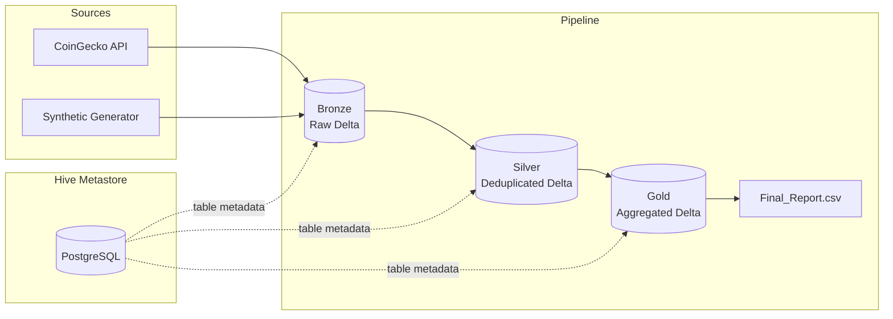

# High-Volume Market Data Pipeline

A robust, end-to-end data engineering pipeline designed to ingest, process, and analyze high-volume cryptocurrency market data. This project implements a **Medallion Architecture** (Bronze, Silver, Gold) using **Apache Spark** and **Delta Lake**, with an optional external **Hive Metastore** backed by **PostgreSQL** for table registration.

## Tech Stack

| Category | Technology | Description |
| :--- | :--- | :--- |
| **Processing Engine** | **Apache Spark 3.5.0** | Distributed data processing. |
| **Storage Format** | **Delta Lake 3.0.0** | ACID transactions and scalable metadata. |
| **Database/Metastore** | **PostgreSQL 16** | External Hive Metastore for table cataloging. |
| **Containerization** | **Docker & Compose** | Simplifies deployment of Spark clusters. |
| **Orchestration** | **PowerShell** | Automated pipeline execution script. |

## Architecture & Data Layers

The pipeline follows the Medallion design pattern to ensure data quality and reliability:

* **Bronze Layer (Raw):** Ingests raw data from the **CoinGecko API** (API mode) or from the **synthetic data generator** (stress-test mode). All layers are partitioned by **partition_date**, which is always derived from the data: `partition_date = to_date(last_updated)`. We never use the current run date for partitioning, so historical data is stored in the correct date folder in both modes.
* **Silver Layer (Cleaned):** Performs data type casting and deduplication on `(id, last_updated)` using **Spark Window Functions**. Reads the full Bronze table (all partition dates) and merges/overwrites by partition; no filter by "today."
* **Gold Layer (Aggregated):** Computes market stats **per partition_date** (top-10 by volume, total market cap, average price). The Gold table and `Final_Report.csv` have **one row per partition_date** present in the data—e.g. 7 days in Bronze yield 7 rows in the report, not just the latest date.

### Partitioning & Accumulation

* **Unified partitioning:** In both API and stress-test runs, `partition_date` is derived only from `last_updated` in the row. If the API omits `last_updated`, it is set from ingestion time so the partition is still data-driven.
* **Bronze accumulation (API mode):** Writes use **replaceWhere** for only the current run’s partition_date(s). Other partition dates in the Delta table are left unchanged, so the table grows over time and can retain multiple days (e.g. the last 7 days of API snapshots) without deleting previous days.
* **Silver/Gold:** Both stages read the full table and group or filter by the actual `partition_date` from the data, so the final report reflects all available days.

### Visual Architecture


```mermaid
flowchart LR
    subgraph Sources
        API[CoinGecko API]
        GEN[Synthetic Generator]
    end

    subgraph Pipeline
        B[(Bronze\nRaw Delta)]
        S[(Silver\nDeduplicated Delta)]
        G[(Gold\nAggregated Delta)]
        CSV[Final_Report.csv]
    end

    subgraph Metastore["Hive Metastore"]
        PG[(PostgreSQL)]
    end

    API --> B
    GEN --> B
    B --> S
    S --> G
    G --> CSV
    PG -.->|table metadata| B
    PG -.->|table metadata| S
    PG -.->|table metadata| G
```

The **Hive Metastore** (PostgreSQL) can run as a side-car to store table metadata for the Gold layer when enabled. In the default configuration the pipeline runs fully on Delta files only and **does not require** Hive; Gold table registration is performed only when Hive is explicitly turned on.

## Getting Started

### Prerequisites
* Docker and Docker Compose installed.
* PowerShell.

### Pipeline Modes

| Mode | How to run | Description |
| :--- | :--- | :--- |
| **Standard (API)** | `.\run_pipeline.ps1` | Fetches top N coins from CoinGecko. Bronze accumulates by partition_date (replaceWhere); Gold report shows one row per day present in Bronze. |
| **Stress Test** | `.\run_pipeline.ps1 -StressTest` | Uses the synthetic data generator (no API). Optional: `-Coins`, `-Days`, `-ExecMemory`, `-TotalCores`. |

Environment variables for API mode: `TOP_N_COINS` (default 50), `API_PAGES` (default 1). For stress test: `STRESS_TEST_COINS`, `STRESS_TEST_DAYS`.

Hive integration is controlled via the `USE_HIVE` environment variable:

| Variable | Default | Effect |
| :--- | :--- | :--- |
| `USE_HIVE` | `false` | Run fully on Delta files; Hive metastore is not used. |
| `USE_HIVE` | `true` | Enable Hive support and register the Gold table in the metastore (requires an initialized PostgreSQL metastore). |

### Setup and Execution (PowerShell)

1.  **Spin up infrastructure:**
    ```powershell
    docker-compose up -d
    ```

2.  **Option A: Run the full pipeline (Recommended)**
    ```powershell
    # Standard mode (CoinGecko API), Hive OFF by default
    powershell -ExecutionPolicy Bypass -File .\run_pipeline.ps1

    # Stress-test mode (synthetic data) — switch and optional flags
    powershell -ExecutionPolicy Bypass -File .\run_pipeline.ps1 -StressTest
    powershell -ExecutionPolicy Bypass -File .\run_pipeline.ps1 -StressTest -Coins 100 -Days 7
    powershell -ExecutionPolicy Bypass -File .\run_pipeline.ps1 -StressTest -Coins 200 -Days 30 -ExecMemory 4g -TotalCores 22
    ```
    | Flag | Description | Default |
    | :--- | :---------- | :------ |
    | `-StressTest` | Use synthetic generator instead of API | — |
    | `-Coins` | Number of synthetic coins | 200 |
    | `-Days` | Days of hourly history | 30 |
    | `-ExecMemory` | Executor memory (e.g. `4g`) | 4g |
    | `-TotalCores` | Cores hint for shuffle partitions | 22 |
    Output: `./data/Final_Report.csv` with one row per **partition_date** in the data (e.g. 7 rows if Bronze has 7 days).

3.  **Option B: Run the Fast Pipeline (Quick Test)**
    ```powershell
    docker cp fast_pipeline.py spark-master:/opt/spark/
    docker exec -it spark-master /opt/spark/bin/spark-submit --packages io.delta:delta-spark_2.12:3.0.0 /opt/spark/fast_pipeline.py
    ```
    This script generates `Final_Report.csv` in the `./data` directory.

4.  **Verify Data:**
    ```powershell
    docker exec -it spark-master /opt/spark/bin/spark-submit /opt/spark/src/utils/check_bronze_data.py
    ```

5.  **Delta Maintenance (optional):**

    After heavy stress-test runs you can compact and clean up the Delta tables:

    ```powershell
    docker exec -it spark-master /opt/spark/bin/spark-submit /opt/spark/src/maintenance/delta_vacuum.py
    ```

    This script runs **OPTIMIZE + ZORDER** and **VACUUM** on the Bronze, Silver, and Gold Delta tables using the centralized paths in `src/config/paths.py`.

## Monitoring & Performance

While the pipeline runs (or after submission), you can monitor the cluster and the running application:

| UI | URL | Purpose |
|----|-----|---------|
| **Spark Master UI** | [http://localhost:8080](http://localhost:8080) | Cluster overview: workers, cores, memory, running/completed applications. |
| **Spark Application UI** | [http://localhost:4040](http://localhost:4040) | Active driver: jobs, stages, tasks, executors, and event timeline. |
| **Spark History Server** | [http://localhost:18080](http://localhost:18080) | Historical view across completed applications backed by event logs. |

In the Application UI you can:

* **Adaptive Query Execution (AQE):** Check the SQL tab and stage metrics for coalesce/split of shuffle partitions and join strategy adjustments.
* **Shuffle partitions:** See `spark.sql.shuffle.partitions` in the Environment tab; in stress-test mode the script sets it to `TotalCores * 4`.
* **Z-Order progress:** After each Silver and Gold write, the pipeline runs `OPTIMIZE ... ZORDER BY`. Monitor the corresponding jobs in the Stages tab to confirm compaction and Z-Order completion.

### Small-file mitigation & maintenance strategy

* **Partitioning:** Silver and Gold tables are partitioned only by `partition_date` to avoid excessive small files from high-cardinality keys such as `symbol`, while still enabling efficient date pruning.
* **Target file size:** Spark Adaptive Query Execution uses an advisory partition size of **128 MB**, aligned with Delta’s `spark.databricks.delta.optimize.maxFileSize`, so shuffle outputs and OPTIMIZE compaction converge on similar file sizes.
* **Incremental OPTIMIZE:** The main pipeline captures the set of `partition_date` values touched in the current run and runs **partition-scoped OPTIMIZE** on Silver and Gold (instead of full-table rewrites) to reduce DBU consumption and write amplification.
* **Z-Ordering:** Silver is Z-ordered by `symbol`, `current_price`, and `market_cap` to accelerate point/range lookups per asset; Gold is Z-ordered by `total_market_cap` to speed aggregate scans. The `delta_vacuum.py` maintenance script uses the same Z-ORDER strategy for consistency.

The Application UI is available only while the driver process is running; the Master UI stays up as long as the Spark Master container is running. With Spark event logging enabled, all application event logs are written under the shared `./spark_events` directory (mounted to `/opt/spark/spark_events` in the containers). The `spark-history-server` service in `docker-compose.yml` reads from this directory so you can inspect completed runs at [http://localhost:18080](http://localhost:18080) even after the driver has exited.

## Troubleshooting

- **Driver exit**: The driver uses `force_stop` and `os._exit(exit_code)` for a clean shutdown. If the terminal still looks busy, wait a few seconds or press `Ctrl+C`.
- **Hive metastore (optional)**: When `USE_HIVE=true`, ensure the `metastore-db` PostgreSQL container is healthy and the metastore schema is initialized (e.g. via `schematool -initSchema`). Leave `USE_HIVE` unset or `false` to skip Hive entirely.
- **Resources (stress test)**: For large `-Coins` / `-Days` runs, allocate at least 8–12 GB RAM to Docker and consider increasing `-ExecMemory` (for example `-ExecMemory 6g`).
- **Containers not healthy**: Run `docker compose ps` and ensure `spark-master` and `metastore-db` are `healthy` before launching the pipeline.
- **Final_Report.csv missing**: Confirm the Gold Aggregation stage completed in the logs; the file is written to `./data/Final_Report.csv`.